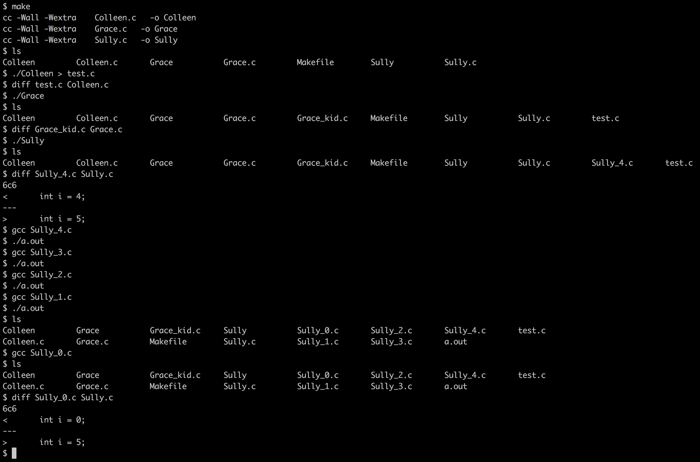

# Dr. Quine

Introduction to [kleene's algorithm](https://en.wikipedia.org/wiki/Kleene%27s_algorithm) by creating [quines](https://en.wikipedia.org/wiki/Quine_(computing)) with certain requirements

See [pdf](./resources/dr_quine.en.pdf) for details

## Colleen

Simple quine.  Prints source to stdout

```bash
./Colleen > test.s
diff Colleen.s test.s
```

## Grace

Prints source to `Grace_kid.s`

```bash
./Grace
diff Grace.s Grace_kid.s
```

## Sully

Prints source to `Sully_X.s` only if X > 0

```bash
./Sully
diff Sully.s Sully_4.s
```


